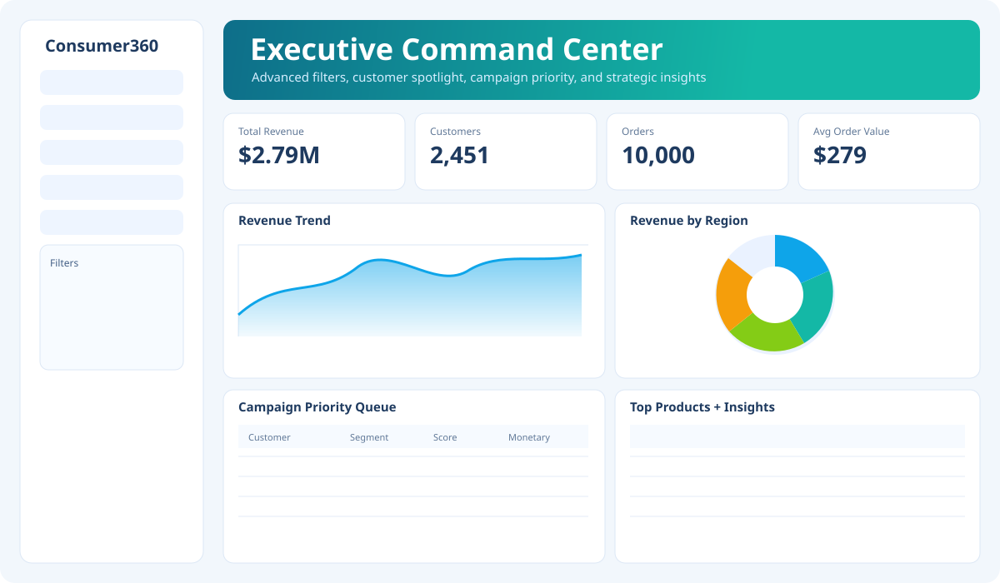
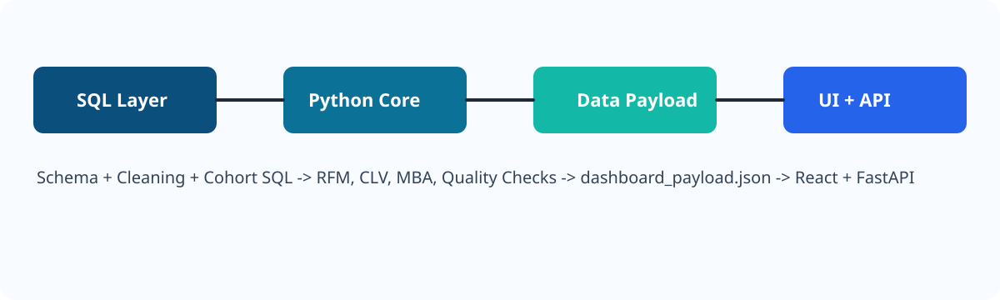

<div align="center">
  

  <h1>Consumer360</h1>
  <p><b>Production-Ready Retail Intelligence Platform</b></p>
  <p><i>Customer Segmentation • CLV Intelligence • Retention Analytics • Campaign Actioning</i></p>

  <p>
    
    
    
    
    
  </p>

  <p>
    <a href="#product-preview">Preview</a> •
    <a href="#architecture-snapshot">Architecture</a> •
    <a href="#quick-start">Quick Start</a> •
    <a href="#api-endpoints">API</a>
  </p>
</div>

---

## Product Preview
<p align="center">
  
</p>

## Architecture Snapshot
<p align="center">
  
</p>

## Why Consumer360
<table>
  <tr>
    <td><b>Champion Discovery</b><br/>Automatically identifies high-value customers for premium engagement.</td>
    <td><b>Churn Risk Prevention</b><br/>Builds action lists to prioritize retention interventions weekly.</td>
  </tr>
  <tr>
    <td><b>Advanced Analytics Stack</b><br/>RFM + CLV + Cohort + Market Basket in a single product workflow.</td>
    <td><b>Business-Ready Delivery</b><br/>Dashboard + API + exports + automation scripts included.</td>
  </tr>
</table>

## Core Capabilities
- **RFM Segmentation Engine**: 1-5 scoring with segment labels (Champions, At Risk, Hibernating, etc.)
- **Predictive CLV**: BG/NBD + Gamma-Gamma modeling via `lifetimes`
- **Cohort Retention Matrix**: Month-wise retention trends for behavioral analysis
- **Market Basket Rules**: Cross-sell associations using support/confidence/lift
- **Data Quality Guardrails**: Validates transaction quality before publishing outputs
- **Executive Dashboard (React)**: Sidebar controls, spotlight search, insights, and campaign priority table
- **FastAPI Service Layer**: Programmatic access to payload, KPIs, campaigns, quality checks

## Quick Start
### 1) Install
```powershell
pip install -r requirements.txt
```

### 2) Run Pipeline
```powershell
python -m src.main --run-date 2026-02-27
```

### 3) Launch Dashboard
```powershell
./run_frontend.ps1
```
Open: `http://localhost:5173`

### 4) Launch API
```powershell
./run_api.ps1
```
Open docs: `http://127.0.0.1:8000/docs`

### 5) One-Command Full Flow
```powershell
./run_consumer360.ps1 -RunDate 2026-02-27 -LaunchFrontend -LaunchApi
```

## API Endpoints
- `GET /health`
- `GET /payload`
- `GET /kpis`
- `GET /campaigns`
- `GET /quality`

## Output Artifacts
- `reports/data_quality_report.json`
- `reports/customer_rfm_segments.csv`
- `reports/customer_clv.csv`
- `reports/cohort_retention.csv`
- `reports/market_basket_rules.csv`
- `reports/campaign_champions.csv`
- `reports/campaign_churn_risk.csv`
- `frontend/public/data/dashboard_payload.json`

## Repository Structure
```text
api/                FastAPI service
config/             Runtime and brand settings
docs/               Docs + visual assets
frontend/           React + Vite dashboard
reports/            Generated outputs
sql/                Schema and SQL scripts
src/                Analytics pipeline modules
```

## Roadmap
- Role-based auth and access control
- PDF executive report export
- Scenario simulator for campaign budget planning
- Docker + CI/CD deployment pipeline

## License
MIT
# Consumer360 Retail Analytics

Consumer360 Retail Analytics is an end-to-end data analytics project that demonstrates how retail transaction data can be transformed into actionable business insights using modern data analytics tools.

The project covers the full analytics pipeline including data engineering, customer analytics, and dashboard visualization.

Tech Stack Used

* PostgreSQL – Data warehouse and schema design
* Python – Data processing and analytics pipeline
* SQL – Data extraction and analytical queries
* Power BI – Interactive dashboard and visualization
* GitHub – Version control and project documentation

---

# Week-wise Work (Week 1 – Week 4)

This project was structured to simulate a real industry analytics workflow.

---

## Week 1 — Data Engineering & Schema

Goal: Build a clean and scalable data warehouse for analytics.

Work Completed

* Imported raw retail transaction dataset into PostgreSQL staging table

```
stg_sales_raw
```

* Cleaned and standardized raw data
* Handled missing values and standardized date formats
* Implemented a **Star Schema data model**

Tables created

```
fact_sales
dim_customer
dim_product
dim_date
```

* The schema was designed to support analytical queries and dashboard reporting.

---

## Week 2 — Analytics Engine (Python)

Goal: Build the analytics logic connected to PostgreSQL.

Modules Implemented

### Database Connection Module

```
config.py
```

Handles secure database credentials and connections.

### Data Loader

```
data_loader.py
```

Loads aggregated customer-level data from PostgreSQL.

### RFM Segmentation

```
rfm_analysis.py
```

Customer segmentation based on:

* Recency
* Frequency
* Monetary value

Customers are grouped into segments such as:

* Champions
* Loyal Customers
* Potential Loyalists
* At Risk
* Hibernating

---

### Cohort Analysis

```
cohort_analysis.py
```

* Identifies customer retention trends
* Calculates cohort index (month difference)
* Generates retention matrix for visualization

---

### Market Basket Analysis

```
market_basket.py
```

* Detects product pairs frequently purchased together
* Useful for cross-sell and bundling strategies

---

### CLV Proxy Generation

```
clv_generate.py
```

* Calculates Customer Lifetime Value proxy score
* Identifies high value customers
* Generates output for dashboard analytics

---

# Week 3 — Dashboard Development (Power BI)

Goal: Build interactive dashboards to visualize analytics insights.

Power BI File

```
dashboard_retail_project.pbix
```

Dashboard Pages

### Page 1 – Customer Analytics Overview

* Total Customers
* Total Revenue
* Average Frequency
* Average Recency

Visualizations

* Customers by Segment
* Revenue by Region
* RFM Scatter Analysis

---

### Page 2 – Cohort Retention Analysis

* Cohort retention matrix
* Customer lifecycle insights
* Retention trend visualization

---

Validation Performed

* Verified Champions segment corresponds to high value customers
* Validated RFM scoring logic
* Confirmed revenue aggregation matches transaction data

---

# Week 4 — Automation Pipeline

Goal: Automate the analytics workflow end-to-end.

Created a single pipeline script

```
run_pipeline.py
```

The pipeline automatically regenerates:

```
data/rfm_results.csv
data/clv_results.csv
data/cohort_retention.csv
data/market_basket_results.csv
```

Power BI dashboards can be refreshed using the latest outputs.

---

# Output Files

| File                      | Purpose                               |
| ------------------------- | ------------------------------------- |
| rfm_results.csv           | Customer RFM metrics and segmentation |
| clv_results.csv           | Customer Lifetime Value proxy scores  |
| cohort_retention.csv      | Retention matrix for cohort analysis  |
| market_basket_results.csv | Frequent product pair analysis        |

---

# How to Run This Project

## 1 Clone the Repository

```
git clone https://github.com/YOUR_GITHUB_USERNAME/consumer360-retail-analytics.git
cd consumer360-retail-analytics
```

---

## 2 Configure Database Credentials

Copy the configuration template:

```
config.example.py
```

Rename it to

```
config.py
```

Update the PostgreSQL credentials locally.

---

## 3 Install Dependencies

```
pip install pandas sqlalchemy psycopg2
```

---

## 4 Run the Analytics Pipeline

```
python run_pipeline.py
```

---

## 5 Refresh Power BI Dashboard

Open

```
dashboard_retail_project.pbix
```

Then click

```
Home → Refresh All
```

---

# Project Status

Data Engineering (SQL) — Completed
Analytics Pipeline (Python) — Completed
Dashboard Development (Power BI) — Completed
Automation Pipeline — Completed

Project Status — COMPLETED

---

# Author

Varshil Shah

BSc IT Student | Data Analytics Enthusiast
